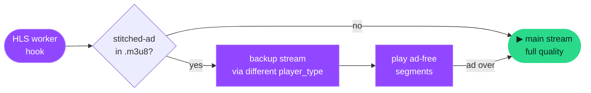

<div align="center">


# Streamblock

### Blocks Twitch &amp; YouTube ads — no blackscreen, no error #4000

<p>
  
  
  
</p>

<p>
  
  
  
  
  
</p>

**English** · [Deutsch](docs/README.de.md)

<sub>Stream-Swap · YouTube ad-stripping · network blocking · cosmetic filtering — each toggled individually</sub>

</div>

---

> [!NOTE]
> **Repository layout** — The extension itself lives in the [`src/`](src/) folder.
> When loading it unpacked (see below), point your browser at **`src/`**, not the repository root.

**Streamblock** removes server-stitched Twitch ads with its **Stream-Swap method**, and combines it with YouTube ad-stripping, a ~336-domain network filter, and cosmetic filtering across all sites.

## 📑 Contents

- [✨ Features](#-features)
- [📦 Installation](#-installation)
- [🧠 How it works](#-how-it-works)
- [🎛️ Strategies](#-strategies)
- [🛡️ Network blocking](#-network-blocking)
- [🗂️ Project structure](#-project-structure)
- [🩹 Troubleshooting](#-troubleshooting)
- [🙌 Credits &amp; notice](#-credits--notice)

---

## ✨ Features

| | Feature | Scope |
|:--:|:--|:--|
| 🎯 | **Stream-Swap** — pulls an ad-free backup stream during Twitch ads, no blackscreen | Twitch |
| ✂️ | **YouTube ad-block** — strips ads from the player response &amp; skips the rest | YouTube |
| 🛡️ | **Network blocking** — ~336 ad, tracking, consent &amp; affiliate domains | Everywhere |
| 🧹 | **Cosmetic filter** — hides ad-bait elements (AdSense, GPT, …) via CSS | Everywhere |
| 🎚️ | **Granular control** — every method toggled individually in the popup | — |
| 📊 | **Live stats** — blocked ads, time saved, detail view | — |
| 🌍 | **Multilingual** — German &amp; English | — |
| 🔒 | **Privacy** — anonymous, aggregated telemetry (opt-out), no URLs | — |

---

## 📦 Installation

### Chrome · Edge · Brave · Opera

```text
1. Open chrome://extensions/  (or edge://extensions/)
2. Enable Developer mode (top right)
3. Click "Load unpacked"
4. Select the "src" folder of this repository
5. Reload your Twitch tab (F5)
```

> [!IMPORTANT]
> Requires a recent Chromium browser (**Chrome/Edge 111+**), because `world: "MAIN"` content scripts are used.

<details>
<summary><b>🦊 Firefox (128+)</b></summary>

<br>

```text
1. Open about:debugging#/runtime/this-firefox
2. Click "Load Temporary Add-on"
3. Select src/manifest.json from this repository
```

Temporary add-ons are removed on restart. `world: "MAIN"` requires Firefox **128+**.

</details>

---

## 🧠 How it works

Twitch embeds ads directly into the live stream (*"stitched ads"*). Instead of cutting the playlist apart (which causes **error #4000** / blackscreen), Streamblock fetches an ad-free backup stream during the ad break:



1. **Worker hook** — hooks into Twitch's HLS worker (where the segment playlists are loaded — *not* on the main thread, so simple `fetch` hooks don't work).
2. **Ad detection** — detects the `stitched-ad` marker in the `.m3u8`.
3. **Stream-Swap** — fetches an ad-free stream via a different `player_type` (`autoplay`, `embed`, …).
4. **Auto-return** — switches back to full quality automatically once the ad is over.

> [!TIP]
> **A short quality drop is normal:** the backup stream is often only available in lower resolution. During the ad the picture may briefly look worse, then goes back up automatically. This is expected behavior — **not a bug**.

<details>
<summary><b>📺 YouTube ad-block — details</b></summary>

<br>

YouTube embeds video ads into the same player response as the actual video, so plain network blocking is **not** enough. The method:

1. **Ad-stripping** — cuts `adPlacements`, `playerAds`, `adSlots` out of the player responses (`/youtubei/v1/player` + `ytInitialPlayerResponse`).
2. **Auto-skip** — skips any remaining ads (clicks skip, fast-forwards unskippable ads to the end, closes overlays).
3. **Display ads** — hides feed/banner/masthead ads via CSS.

> The video CDN (`googlevideo.com`) is **never** blocked, so playback doesn't break. Only ad-telemetry paths are blocked (`/api/stats/ads`, `/ptracking`, `/pagead/`).

</details>

---

## 🎛️ Strategies

Every method can be toggled **individually** in the popup:

| Method | Scope | Description | Effect |
|:--|:--:|:--|:--|
| **Stream-Swap** | Twitch | Ad-free backup stream during ads (core method) | 🔄 Tab reload |
| **Strip ad segments** | Twitch | Cuts ad chunks out of the playlist | 🔄 Tab reload |
| **player_type spoof** | Twitch | Forces an ad-free player type on token requests | 🔄 Tab reload |
| **DOM ad remover** | Twitch | Hides banner &amp; display ads via CSS | ⚡ Instant |
| **YouTube ad-block** | YouTube | Strips video ads &amp; auto-skips the rest | 🔄 Tab reload |
| **Network blocking** | Everywhere | Blocks ~336 ad, tracking &amp; consent domains | ⚡ Instant |
| **Cosmetic filter** | Everywhere | Hides ad-bait elements on **all** sites | ⚡ Instant |

> [!NOTE]
> The three Twitch methods and the YouTube ad-block hook into code that only runs on page load — so toggling them reloads the tab automatically. **Network blocking, DOM remover and cosmetic filter take effect instantly.**

---

## 🛡️ Network blocking

The block list (`rules.json`) is generated from `build-rules.js` (**336 rules**) and covers:

<details>
<summary><b>Show all categories</b></summary>

<br>

- 📢 **Ads / ad exchanges** — DoubleClick, IMA SDK, Criteo, PubMatic, Taboola, Outbrain, AdColony, Unity Ads …
- 📈 **Analytics / tracking** — Google Analytics, GTM, Hotjar, Mixpanel, Segment, Clarity, Lucky Orange, Mouseflow …
- 🐞 **Error trackers** — Sentry, Bugsnag
- 👥 **Social trackers** — Facebook, TikTok, Pinterest, Reddit, LinkedIn, X/Twitter Ads
- 🍪 **Consent / cookie banners** — OneTrust, Cookiebot, Usercentrics, Didomi, Sourcepoint …
- 🧪 **A/B testing** — Optimizely, VWO, AB Tasty, Kameleoon, Adobe Target …
- 🔗 **Affiliate networks** — Awin, CJ, Rakuten, ShareASale, Impact, Skimlinks …
- 📱 **Mobile / OEM telemetry** — Xiaomi, Oppo, Huawei, Samsung, Apple, Yandex, Yahoo
- 🎣 **Script bait** — generic `/ads.js`, `/pagead/` paths

</details>

> To extend the list: add domains in `build-rules.js` and run `node build-rules.js`.
> Twitch playback domains (`ttvnw.net`, `jtvnw.net`, …) are excluded by a safety net so the stream never breaks.

> [!WARNING]
> The **cosmetic filter** runs on **all** websites (not just Twitch), so the browser asks for access to "all sites" on install. Can be turned off in the popup at any time.

---

## 🗂️ Project structure

<details>
<summary><b>Show files</b></summary>

<br>

```text
.
├── src/                    # ← the extension (load this folder unpacked)
│   ├── manifest.json       # Extension manifest (MV3)
│   ├── rules.json          # Network blocking rules (generated)
│   ├── background.js       # Service worker (stats, settings, badge)
│   ├── inject.js           # MAIN · Twitch — worker hook + Stream-Swap
│   ├── content.js          # ISOLATED · Twitch — CSS, stats, on/off
│   ├── youtube.js          # MAIN · YouTube — ad-stripping + auto-skip
│   ├── yt-bridge.js        # ISOLATED · YouTube — settings mirror + stats
│   ├── cosmetic.js         # ISOLATED · all sites — cosmetic filter
│   ├── i18n.js             # Languages (DE / EN)
│   ├── telemetry.js        # Anonymous, aggregated stats (opt-out)
│   ├── update-check.js     # Version check against streamblock.online
│   ├── ui/                 # Popup & detail view
│   │   ├── popup.html/js/css   # Popup (stats & toggles)
│   │   ├── detail.html/js/css  # Detail view (live block log)
│   │   └── donate-ui.js        # Donation UI helper
│   └── icons/              # Extension icons (16/48/128)
├── scripts/                # Development tools (not shipped)
│   ├── build-rules.js      # Generator for src/rules.json (domain lists)
│   └── build-icons.js      # Icon generator
├── docs/                   # CHANGELOG, SECURITY, German README
└── .github/                # Issue/PR templates & CI workflow
```

</details>

---

## 🩹 Troubleshooting

<details>
<summary><b>Ads still show / blackscreen</b></summary>

<br>

- Reload the Twitch tab (**F5**) after installing/updating.
- In `chrome://extensions/` reload the extension (↺), then reload the tab.
- Twitch changes its technique regularly — see updates of the underlying method (credits below).

</details>

<details>
<summary><b>Picture stays in low quality</b></summary>

<br>

- Set quality manually in the player gear to **"Source"/"1080p"**.
- Can happen right after switching back from an ad — a tab reload fixes it.

</details>

<details>
<summary><b>Stream won't start / loads forever</b></summary>

<br>

- Toggle the extension off and on again (the switch in the popup reloads the tab).

</details>

---

## 🙌 Credits &amp; notice

The core method (worker hook + Stream-Swap) is based on the open-source project **[TwitchAdSolutions](https://github.com/pixeltris/TwitchAdSolutions)** by *pixeltris* (variant `video-swap-new`, MIT license), adapted into a browser extension with UI, statistics and an on/off switch. See [LICENSE](LICENSE).

> [!NOTE]
> This extension is for **educational purposes**. Consider supporting your favorite streamers via a Twitch subscription or other means — ads are a source of income for creators.

<div align="center">
<sub>Made with 💜 for ad-free streaming</sub>
</div>
