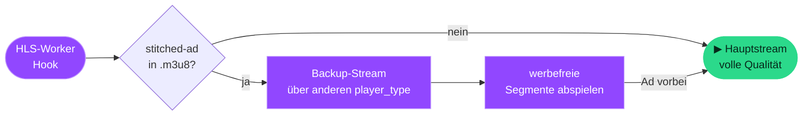

<div align="center">


# Streamblock

### Blockiert Twitch- &amp; YouTube-Werbung — ohne Blackscreen, ohne Fehler #4000

<p>
  
  
  
</p>

<p>
  
  
  
  
  
</p>

[English](../README.md) · **Deutsch**

<sub>Stream-Swap · YouTube Ad-Stripping · Network-Blocking · Cosmetic-Filter — alles einzeln abschaltbar</sub>

</div>

---

> [!NOTE]
> **Repository-Aufbau** — Die Extension selbst liegt im Ordner [`src/`](../src/).
> Zum Laden als entpackte Erweiterung (siehe unten) den Browser auf **`src/`** zeigen lassen, nicht auf das Repository-Hauptverzeichnis.

**Streamblock** entfernt server-eingebettete Twitch-Werbung mit der **Stream-Swap-Methode** und kombiniert sie mit YouTube-Ad-Stripping, einem ~336 Domains starken Netzwerk-Filter und Cosmetic-Filtering auf allen Seiten.

## 📑 Inhalt

- [✨ Features](#-features)
- [📦 Installation](#-installation)
- [🧠 Wie es funktioniert](#-wie-es-funktioniert)
- [🎛️ Strategien](#-strategien)
- [🛡️ Network-Blocking](#-network-blocking)
- [🗂️ Projektstruktur](#-projektstruktur)
- [🩹 Fehlerbehebung](#-fehlerbehebung)
- [🙌 Credits &amp; Hinweis](#-credits--hinweis)

---

## ✨ Features

| | Feature | Reichweite |
|:--:|:--|:--|
| 🎯 | **Stream-Swap** — werbefreier Backup-Stream während Twitch-Ads, kein Blackscreen | Twitch |
| ✂️ | **YouTube Ad-Block** — schneidet Ads aus der Player-Antwort &amp; überspringt den Rest | YouTube |
| 🛡️ | **Network-Blocking** — ~336 Ad-, Tracking-, Consent- &amp; Affiliate-Domains | Überall |
| 🧹 | **Cosmetic-Filter** — blendet Ad-Bait-Elemente (AdSense, GPT, …) per CSS aus | Überall |
| 🎚️ | **Granulare Kontrolle** — jede Methode einzeln im Popup an/aus | — |
| 📊 | **Live-Statistik** — geblockte Ads, gesparte Zeit, Detail-Ansicht | — |
| 🌍 | **Mehrsprachig** — Deutsch &amp; Englisch | — |
| 🔒 | **Privatsphäre** — anonyme, aggregierte Telemetrie (opt-out), keine URLs | — |

---

## 📦 Installation

### Chrome · Edge · Brave · Opera

```text
1. chrome://extensions/  (bzw. edge://extensions/) öffnen
2. Entwicklermodus aktivieren (oben rechts)
3. „Entpackte Erweiterung laden" klicken
4. Den Ordner "src" dieses Repositorys auswählen
5. Twitch-Tab neu laden (F5)
```

> [!IMPORTANT]
> Benötigt einen aktuellen Chromium-Browser (**Chrome/Edge 111+**), da `world: "MAIN"` Content-Scripts verwendet werden.

<details>
<summary><b>🦊 Firefox (128+)</b></summary>

<br>

```text
1. about:debugging#/runtime/this-firefox öffnen
2. „Temporäre Erweiterung laden" klicken
3. src/manifest.json aus diesem Repository auswählen
```

Temporäre Extensions werden beim Neustart entfernt. `world: "MAIN"` erfordert Firefox **128+**.

</details>

---

## 🧠 Wie es funktioniert

Twitch bettet Werbung direkt in den Live-Stream ein (*„stitched ads"*). Statt die Playlist zu zerschneiden (das verursacht **Fehler #4000** / Blackscreen), holt Streamblock während der Werbung einen werbefreien Backup-Stream:



1. **Worker-Hook** — klinkt sich in Twitchs HLS-Worker ein (dort werden die Segment-Playlists geladen, *nicht* im Hauptthread – einfache `fetch`-Hooks greifen daher nicht).
2. **Ad-Erkennung** — erkennt die `stitched-ad`-Markierung in der `.m3u8`.
3. **Stream-Swap** — lädt über einen anderen `player_type` (`autoplay`, `embed`, …) einen werbefreien Stream.
4. **Auto-Rückkehr** — wechselt nach der Werbung automatisch in volle Qualität zurück.

> [!TIP]
> **Kurzer Quali-Drop ist normal:** Der Backup-Stream ist oft nur in niedrigerer Auflösung verfügbar. Während der Werbung kann das Bild kurz schlechter werden, danach geht es automatisch wieder hoch. Das ist erwartetes Verhalten — **kein Bug**.

<details>
<summary><b>📺 YouTube Ad-Block — Details</b></summary>

<br>

YouTube bettet Video-Werbung in dieselbe Player-Antwort wie das echte Video – reines Netzwerk-Blocken reicht daher **nicht**. Die Methode:

1. **Ad-Stripping** — schneidet `adPlacements`, `playerAds`, `adSlots` aus den Player-Antworten (`/youtubei/v1/player` + `ytInitialPlayerResponse`).
2. **Auto-Skip** — überspringt verbleibende Ads (Skip-Button, unskippbare Ads ans Ende spulen, Overlays schließen).
3. **Display-Ads** — versteckt Feed-/Banner-/Masthead-Werbung per CSS.

> Das Video-CDN (`googlevideo.com`) wird **nie** geblockt, damit die Wiedergabe nicht bricht. Geblockt werden nur Ad-Telemetrie-Pfade (`/api/stats/ads`, `/ptracking`, `/pagead/`).

</details>

---

## 🎛️ Strategien

Jede Methode lässt sich im Popup **einzeln** an- und ausschalten:

| Methode | Reichweite | Beschreibung | Wirkung |
|:--|:--:|:--|:--|
| **Stream-Swap** | Twitch | Werbefreier Backup-Stream während Ads (Kernmethode) | 🔄 Tab-Reload |
| **Ad-Segmente entfernen** | Twitch | Schneidet Ad-Stücke aus der Playlist (Strip) | 🔄 Tab-Reload |
| **player_type Spoof** | Twitch | Erzwingt werbefreien Player-Typ bei Token-Anfragen | 🔄 Tab-Reload |
| **DOM Ad-Remover** | Twitch | Versteckt Banner- &amp; Display-Ads per CSS | ⚡ Sofort |
| **YouTube Ad-Block** | YouTube | Schneidet Video-Werbung &amp; überspringt Ads automatisch | 🔄 Tab-Reload |
| **Network-Blocking** | Überall | Blockiert ~336 Ad-, Tracking- &amp; Consent-Domains | ⚡ Sofort |
| **Cosmetic-Filter** | Überall | Blendet Ad-Bait-Elemente auf **allen** Seiten aus | ⚡ Sofort |

> [!NOTE]
> Die drei Twitch-Methoden und der YouTube-Ad-Block greifen in Hooks, die nur beim Seitenladen gesetzt werden — beim Umschalten wird der Tab daher automatisch neu geladen. **Network-Blocking, DOM-Remover und Cosmetic-Filter wirken sofort.**

---

## 🛡️ Network-Blocking

Die Blockliste (`rules.json`) wird aus `build-rules.js` generiert (**336 Regeln**) und deckt ab:

<details>
<summary><b>Alle Kategorien anzeigen</b></summary>

<br>

- 📢 **Werbung / Ad-Exchanges** — DoubleClick, IMA SDK, Criteo, PubMatic, Taboola, Outbrain, AdColony, Unity Ads …
- 📈 **Analytics / Tracking** — Google Analytics, GTM, Hotjar, Mixpanel, Segment, Clarity, Lucky Orange, Mouseflow …
- 🐞 **Fehler-Tracker** — Sentry, Bugsnag
- 👥 **Social-Tracker** — Facebook, TikTok, Pinterest, Reddit, LinkedIn, X/Twitter Ads
- 🍪 **Consent / Cookie-Banner** — OneTrust, Cookiebot, Usercentrics, Didomi, Sourcepoint …
- 🧪 **A/B-Testing** — Optimizely, VWO, AB Tasty, Kameleoon, Adobe Target …
- 🔗 **Affiliate-Netzwerke** — Awin, CJ, Rakuten, ShareASale, Impact, Skimlinks …
- 📱 **Mobile / OEM-Telemetrie** — Xiaomi, Oppo, Huawei, Samsung, Apple, Yandex, Yahoo
- 🎣 **Script-Bait** — generische `/ads.js`, `/pagead/` Pfade

</details>

> Liste erweitern: Domains in `build-rules.js` ergänzen und `node build-rules.js` ausführen.
> Twitch-Playback-Domains (`ttvnw.net`, `jtvnw.net`, …) sind durch ein Sicherheitsnetz ausgeschlossen, damit der Stream nie bricht.

> [!WARNING]
> Der **Cosmetic-Filter** läuft auf **allen** Webseiten (nicht nur Twitch), daher fragt der Browser bei der Installation nach Zugriff auf „alle Websites". Im Popup jederzeit abschaltbar.

---

## 🗂️ Projektstruktur

<details>
<summary><b>Dateien anzeigen</b></summary>

<br>

```text
.
├── src/                    # ← die Extension (diesen Ordner entpackt laden)
│   ├── manifest.json       # Extension-Manifest (MV3)
│   ├── rules.json          # Network-Blocking Regeln (generiert)
│   ├── background.js       # Service Worker (Stats, Settings, Badge)
│   ├── inject.js           # MAIN · Twitch — Worker-Hook + Stream-Swap
│   ├── content.js          # ISOLATED · Twitch — CSS, Stats, An/Aus
│   ├── youtube.js          # MAIN · YouTube — Ad-Stripping + Auto-Skip
│   ├── yt-bridge.js        # ISOLATED · YouTube — Settings-Mirror + Stats
│   ├── cosmetic.js         # ISOLATED · alle Seiten — Cosmetic-Filter
│   ├── i18n.js             # Sprachen (DE / EN)
│   ├── telemetry.js        # Anonyme, aggregierte Statistik (opt-out)
│   ├── update-check.js     # Versionsprüfung gegen streamblock.online
│   ├── ui/                 # Popup & Detail-Ansicht
│   │   ├── popup.html/js/css   # Popup (Stats & Schalter)
│   │   ├── detail.html/js/css  # Detail-Ansicht (Live-Block-Log)
│   │   └── donate-ui.js        # Spenden-UI-Helfer
│   └── icons/              # Extension-Icons (16/48/128)
├── scripts/                # Entwickler-Tools (nicht ausgeliefert)
│   ├── build-rules.js      # Generator für src/rules.json (Domain-Listen)
│   └── build-icons.js      # Icon-Generator
├── docs/                   # CHANGELOG, SECURITY, deutsche README
└── .github/                # Issue/PR-Vorlagen & CI-Workflow
```

</details>

---

## 🩹 Fehlerbehebung

<details>
<summary><b>Werbung wird trotzdem angezeigt / Blackscreen</b></summary>

<br>

- Twitch-Tab neu laden (**F5**) nach Installation/Update.
- In `chrome://extensions/` die Extension neu laden (↺), dann Tab neu laden.
- Twitch ändert seine Technik regelmäßig — siehe Updates der zugrunde liegenden Methode (Credits unten).

</details>

<details>
<summary><b>Bild bleibt dauerhaft in niedriger Qualität</b></summary>

<br>

- Qualität manuell im Player-Zahnrad auf **„Quelle"/„1080p"** stellen.
- Kann passieren, wenn direkt nach einer Werbung umgeschaltet wurde — ein Tab-Reload behebt es.

</details>

<details>
<summary><b>Stream startet nicht / lädt ewig</b></summary>

<br>

- Extension kurz aus- und wieder einschalten (Schalter im Popup lädt den Tab neu).

</details>

---

## 🙌 Credits &amp; Hinweis

Die Kern-Methode (Worker-Hook + Stream-Swap) basiert auf dem Open-Source-Projekt **[TwitchAdSolutions](https://github.com/pixeltris/TwitchAdSolutions)** von *pixeltris* (Variante `video-swap-new`, MIT-Lizenz), angepasst und in eine Browser-Extension mit UI, Statistik und An/Aus-Schalter verpackt. Siehe [LICENSE](LICENSE).

> [!NOTE]
> Diese Extension ist für **Bildungszwecke**. Erwäge, deine Lieblings-Streamer über ein Twitch-Abo oder andere Wege zu unterstützen — Werbung ist eine Einnahmequelle für Creator.

<div align="center">
<sub>Made with 💜 for ad-free streaming</sub>
</div>
